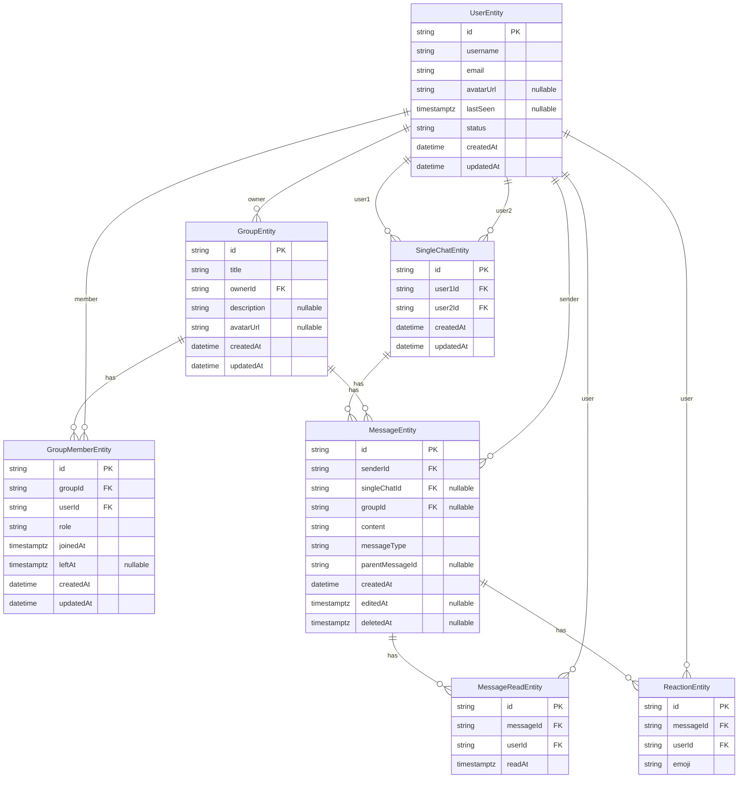

# معماری نهایی چت (NestJS + Socket.IO)

این نسخه، جمع‌بندی نهایی اصلاحات معماری است با این هدف که:

- داده‌ها مبهم نشوند
- constraintها جلوی باگ‌های آینده را بگیرند
- اضافه‌کردن feature جدید بعداً دردسر نشود

---

## ۱. اصول پایه (Design Principles)

- **Single source of truth**: هر پیام دقیقاً به یک کانتکست تعلق دارد (single یا group)
- **DB-first safety**: قیدهای دیتابیس جلوی حالت‌های نامعتبر را می‌گیرند
- **Feature-ready**: reply، forward، read-receipt و media بدون refactor اساسی قابل اضافه‌شدن هستند

---

## ۲. موجودیت‌ها و قیدهای نهایی

### ۲.۱ ChatBaseEntity (abstract)

- کلاس پایه برای SingleChat و Group با فیلدهای مشترک: `id`, `createdAt`, `updatedAt`
- در TypeORM به صورت **Concrete Table Inheritance** (دو جد جدا: `single_chats`, `groups`)

### ۲.۲ MessageEntity (هسته سیستم)

- هر پیام یا متعلق به SingleChat است یا Group
- هرگز هر دو، هرگز هیچ‌کدام

**Constraint دیتابیس (اجباری):**

```
(single_chat_id IS NOT NULL AND group_id IS NULL)
OR
(single_chat_id IS NULL AND group_id IS NOT NULL)
```

**اعتبارسنجی در سرویس:** فقط یکی از `singleChatId` یا `groupId` مقدار داشته باشد (XOR).

**فیلدها (از جمله آماده برای آینده):**

- `parentMessageId` (reply / thread)
- `messageType` (text, image, file)
- `deletedAt` (soft delete)
- `editedAt`

### ۲.۳ SingleChatEntity

- فقط یک چت فعال بین هر دو کاربر وجود دارد
- ترتیب کاربران باید ثابت باشد

**Rule:**

- قبل از ذخیره: `user1Id < user2Id`
- DB: `UNIQUE(user1Id, user2Id)`

نتیجه: A–B و B–A دیگر نداریم

### ۲.۴ GroupEntity + GroupMemberEntity

- Group owner یک FK صریح به User است (`ownerId`)
- مالک به صورت یک رکورد در GroupMember با نقش `owner` و `leftAt = NULL` هم نگه‌داری می‌شود
- عضویت فعال یعنی `leftAt IS NULL`

**قید مهم:**

- فقط یک عضویت فعال برای هر (groupId, userId)؛ در کوئری‌ها شرط `leftAt IS NULL`
- ترجیحاً با partial unique index روی `(groupId, userId) WHERE left_at IS NULL`

**Roleها:**

- owner
- admin
- member

### ۲.۵ فیلدها و جداول اضافه‌شده (اختیاری / نسخه‌های بعد)

| مورد                  | توضیح                                                   |
| --------------------- | ------------------------------------------------------- |
| **UserEntity**        | `avatarUrl`, `lastSeen`, `status` (online/offline/away) |
| **GroupEntity**       | `description`, `avatarUrl`                              |
| **MessageEntity**     | `messageType`, `parentMessageId` (در بالا آمده)         |
| **MessageReadEntity** | جد جدا: `messageId`, `userId`, `readAt` (read receipt)  |
| **ReactionEntity**    | جد جدا: `messageId`, `userId`, `emoji` (واکنش به پیام)  |

---

## ۳. ER Diagram (نسخه پایدار)



**قیدهای کلیدی در نمودار:**

- Message: فقط یکی از `singleChatId` یا `groupId` مقدار داشته باشد (CHECK در DB)
- SingleChat: `UNIQUE(user1Id, user2Id)` با ترتیب ثابت
- GroupMember: عضو فعال با `leftAt IS NULL`

---

## ۴. ساختار ماژول‌های NestJS (نهایی)

```
src/
├── main.ts
├── app.module.ts
├── common/
│   └── entities/
│       └── chat-base.entity.ts
├── modules/
│   ├── user/
│   ├── single-chat/
│   ├── group/
│   ├── message/
│   └── chat-gateway/
└── config/
```

### Chat Gateway

- **Roomها:**
  - `single:{singleChatId}`
  - `group:{groupId}`
- **Eventها (مشترک برای single و group):**
  - `message:send`
  - `message:edit`
  - `message:delete` (soft delete)
  - `typing:start` / `typing:stop`
  - `message:read` (read receipt)
- اتصال: پس از احراز هویت، کلاینت به roomهای مربوط (چت‌های باز + گروه‌های عضو) join می‌شود.

---

## ۵. آیا بعداً می‌شود feature اضافه کرد؟ (بله، بدون درد)

این معماری **عمداً future-proof** است.

می‌توانی بدون شکستن ساختار:

- Reply / Thread (با `parentMessageId`)
- Forward
- Reaction (جد ReactionEntity)
- Read Receipt (جد MessageReadEntity)
- Media / File (`messageType`)
- Pin Message
- Archive / Mute

را اضافه یا گسترش بدهی.

**خط قرمزها رعایت شده‌اند:**

- Message context شفاف است (XOR single/group)
- Chatها تکراری نمی‌شوند (UNIQUE + ترتیب ثابت)
- Group member state قابل اعتماد است (`leftAt IS NULL`)

---

## ۶. جمع‌بندی نهایی

این معماری:

- برای MVP تمیز است
- برای نسخه ۲ و ۳ هم زنده می‌ماند
- refactor بزرگ تحمیل نمی‌کند

اگر از این جلوتر خراب شود، تقصیر معماری نیست، تقصیر عجله است.
